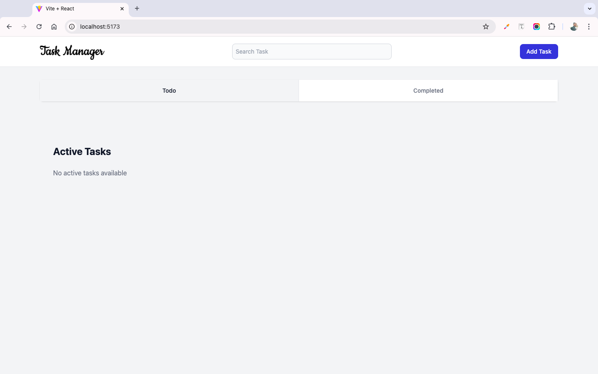

# **Task Manager Application**

A simple and intuitive task management application that allows users to efficiently manage their tasks with basic and advanced features. This application provides features like adding tasks, deleting tasks, searching for tasks, marking them as completed, setting priorities, sorting them, and storing them persistently in local storage.

---

## **Features**

### **Basic Features**
1. **Task Input**: Users can add tasks with a title.
2. **Task Deletion**: Tasks can be deleted individually.
3. **Task Persistence**: All tasks are saved in local storage, ensuring they remain available even after refreshing the browser.

### **Stretch Goals**
1. **Task Search**: Use the search bar to quickly find tasks by title or description.
2. **Task Completion**: Mark tasks as completed or incomplete.
3. **Priority Setting**: Assign a priority level (e.g., High, Medium, Low) to tasks.
4. **Task Sorting**: Sort tasks by criteria such as completion status, priority, or creation date.
5. **UI Animation**: Enhance the user interface with animations for a smoother user experience.

---

## **Setup and Launch Process**

### **Prerequisites**
- Node.js installed on your system.
- A code editor (e.g., VS Code) for local development.
- Basic knowledge of React.js and Tailwind CSS.

### **Steps to Run the Application**
1. **Clone the Repository**:
   ```bash
   git clone https://github.com/AvinashKumarMahato/Task-Manager.git
   cd task-manager
   ```

2. **Install Dependencies**:
   Run the following command to install all required dependencies:
   ```bash
   npm install
   ```

3. **Start the Development Server**:
   Launch the application locally:
   ```bash
   npm run dev
   ```

4. **Access the Application**:
   Open your browser and navigate to:
   ```
   http://localhost:5173/
   ```

---

## **Assumptions Made During Development**

1. **Local Storage**:
   - Local storage is used to persist tasks, assuming the browser environment supports it.

2. **Task Completion**:
   - A "completed" task is indicated visually with a strikethrough or a different style.

3. **Priority System**:
   - Priority levels are predefined as High, Medium, and Low, with sorting functionality based on these levels.

4. **Responsiveness**:
   - The application is built with Tailwind CSS for responsiveness and is optimized for both desktop and mobile devices.

5. **UI Animations**:
   - Animations are kept minimal for better performance, using Tailwind's transition utilities.

---

## **Screenshots**

### **Home Page**


### **Add Task**


### **Todo Page**


### **Completed Page**


---

## **Technologies Used**

1. **React.js**: Component-based architecture for building the user interface.
2. **Tailwind CSS**: Utility-first CSS framework for fast styling.
3. **Local Storage**: Browser storage for persisting tasks.


## **Author**

- **Avinash Mahato**  
    React.js Developer  
  [LinkedIn](https://www.linkedin.com/in/avinash-mahato) | [GitHub](https://github.com/AvinashKumarMahato)
